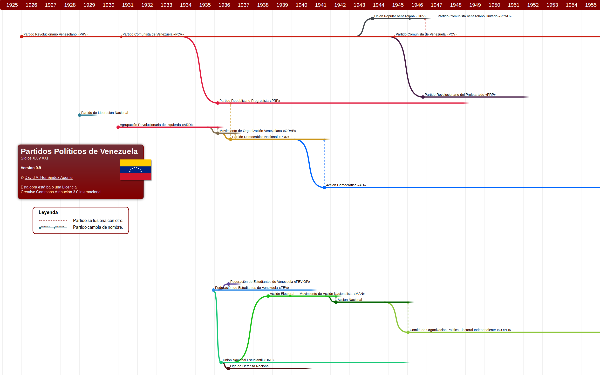

# Partidos Políticos de Venezuela Siglos XX y XXI

## Línea de tiempo de los partidos políticos de Venezuela

Proyecto en desarrollo.

---

Partidos/Nodos registrados: 285

Última actualización (dd/mm/yyyy): 19/02/2019

---

---

## Motivación

Tomando la idea de <a href="https://github.com/FabioLolix/LinuxTimeline/" target="_blank">GNU Linux Distribution Timeline</a> donde se muestra la línea de tiempo de las diferentes distribuciones del sistema Linux, se me ocurrió hacer algo similar con los partidos políticos de Venezuela.

En ambos caso se hace uso del cladograma como recurso esquemático que permite visualizar la evolución de los actores.

## Dominio

Decidí realizar el ejercicio con los partidos políticos establecidos en Venezuela a partir del año 1900 hasta la actualidad. A medida que salgan nuevos partidos estos se irán agregando.

## Fuentes

Los datos de los partidos que van desde principio del siglos XX hasta finales de los años 70 se toman principalmente del libro "[Los partidos políticos en la evolución histórica venezolana](https://openlibrary.org/books/OL2898582M/Los_partidos_poli%CC%81ticos_en_la_evolucio%CC%81n_histo%CC%81rica_venezolana)" de Manuel Vicente Magallanes. No todos los partidos citados en el libro han sido incluidos. Por ejemplo, partidos municipales o regionales de este período no fueron tomados en cuenta (en su gran mayoría), tampoco aquellos para los cuales no logré dar con su fecha de fundación.

Además, para los partidos políticos fundados antes del año 2000, se han considerado aquellos citados en los documentos históricos del [Consejo Nacional Electoral de Venezuela](http://cne.gob.ve/web/estadisticas/index_resultados_elecciones_anteriores.php) (CNE), así como aquellos que aparecen en la colección de datos provista por la [Universidad de Texas](https://repositories.lib.utexas.edu/handle/2152/16391).

Otras fuentes incluyen páginas web, relatos y entrevistas en blogs, revistas y periódicos; y por supuesto, la Wikipedia.

En el gráfico, cada nombre de partido está enlazado a la referencia web de donde se tomó la información para establecer su fecha de fundación.

## Datos claves

Para que el partido aparezca en la lista es necesario 3 datos principales, fecha de fundación, fecha de disolución (si aplicara) y la fuente de donde se obtuvo la información.

### Actividad

Un partido se considera en estado activo si ha sido habilitado por el CNE o si aún no estando habilitado ha tenido actividad pública comprobable, de lo contrario se asume su disolución.

### Fundación

La fecha de su fundación se señala con un punto grande. En caso de no tener la fecha exacta se utiliza la primera referencia encontrada sobre el partido político o en última instancia, el año de la primera participación en un proceso electoral.

### Disolución

El gráfico muestra el fin de la línea de tiempo del partido para la fecha en que este fue disuelto. Si el partido fue disuelto o pasó a un estado de inactividad y se desconocen las fechas de estos eventos, se darán dos escenarios para establecer este dato. Estos escenarios giran básicamente en torno a la premisa de si ganó o no algún cargo en su última participación electoral.

* Si no ganó, se establece como fecha final el 1 de enero del año siguiente a su última aparición en un proceso electoral.
* En caso de que el partido haya logrado hacerse con algún puesto en la contienda electoral, pero de igual forma pasó a un estado de inactividad, se tomará como año de disolución el año en que culmina el período para el cual el ganador fue elegido.

### Escisiones

Las divisiones y partidos derivados de otros se indican como ramas que nacen del partido padre.

### Fusiones

Las fusiones se indican con un punto pequeño acompañado de una línea vertical punteada que arranca desde el partido que se disuelve hasta el partido al cual se adhiere. El punto y la línea punteada serán del color de la línea del tiempo del partido receptor.

### Refundación

Los cambios de nombres se indican con un punto pequeño y el nuevo nombre del partido. En caso de ser refundación, el nombre se mantiene.

## ¿Desea colaborar?

Si piensa que hay algún error o tiene los datos de un partido que no se encuentra listado, puede dejar un mensaje con los datos a corregir: Nombre del partido, fecha de fundación, fecha de disolución (si aplica) y la fuente de donde se recogen esos datos.

Este proyecto se lleva en un repositorio de [github](https://github.com/davidhdz/ppvTimeline), desde allí también puede colaborar haciendo uso de las herramientas ofrecidas por la plataforma.
